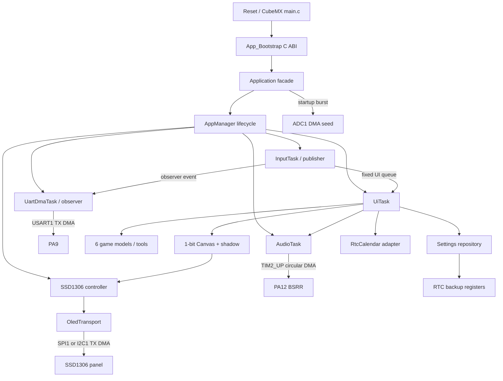

# 固件架构

## 目标与约束

STM32F103C8T6 只有 64 KiB Flash、20 KiB SRAM，没有 MMU，也不适合依赖动态内存。架构采用四个原则：静态容量、显式所有权、可测试核心、薄 HAL 适配层。CubeMX 管理寄存器、时钟和 IRQ 入口，产品行为位于 `App`，避免被代码生成器覆盖。

## 分层与所有权

`Core` 是由 CubeMX 表达的平台层：GPIO、DMA、ADC、SPI、I2C、RTC、TIM2、TIM4、USART、时钟树和中断入口。`App/Src/app_bridge.cpp` 是唯一 C→C++ 启动桥。`Application` 静态拥有所有服务和数据，并通过 `AppManager` 注册生命周期；没有服务通过堆创建或删除。

`GAMEBOX_OLED_INTERFACE=SPI|I2C` 在构建时选择显示接口，默认 SPI。选择结果生成 `GAMEBOX_OLED_SPI=1|0`，未选择的总线与引脚不初始化。`Ssd1306` 拥有控制器初始化、成功帧 shadow、显示设置和恢复状态；`platform::OledTransport` 拥有命令/数据传输、总线复位、DMA 中断桥接和静态完成信号量。UI 不操作 SPI/I2C 寄存器。

`AppModule` 定义 initialize/deinitialize 状态机，`AppManager` 按注册顺序初始化并在失败时逆序回滚。`AppTask` 使用调用方提供的静态 TCB 和栈；任务停止后驻留等待并能复用，而不是自删后立刻复用 TCB。

硬件无关核心包括 `ButtonEngine`、`Tween`、`Spring`、`MotionClock`、`Canvas`、五个独立游戏模型（Piano 只需 UI/Audio 状态）、`SettingsCodec` 和 `CalendarCodec`。这些组件由本机测试直接编译，不依赖 HAL 或 FreeRTOS。Canvas 的矩形填充、横纵线和 6×8 字符直接合并 SSD1306 页字节，避免逐像素读改写；裁剪、反色和 dirty page 的结果由像素参考实现验证。

启动严格分为两个阶段：第一阶段尚未创建任何 FreeRTOS 对象，依次完成 ADC DMA 熵采样、SSD1306 初始化尝试、RTC/设置恢复、亮度设置和首帧 blocking 传输尝试；OLED 未接或总线失败只使显示进入离线重试，不阻止输入、音频和 UI 启动。第二阶段才由 AppManager 创建静态信号量、队列和任务，然后立刻启动调度器。Cortex-M3 FreeRTOS port 会在调度器前保持内核临界区中断屏蔽，因此任何依赖 TIM4 tick 或 DMA IRQ 的 HAL 操作都不得放在第二阶段。

## 设计模式

| 模式 | 使用位置 | 解决的问题 |
|---|---|---|
| Facade | `Application` | 隐藏模块装配和启动顺序 |
| Template Method | `AppModule`、`AppTask` | 统一初始化、回滚、任务入口和停止协议 |
| State | UI View、游戏 GamePhase、每键状态 | 取代旧固件的阻塞式嵌套循环 |
| Observer / Publish–Subscribe | `ButtonEventObserver` | 让 UART 诊断订阅按键，而不让输入服务依赖串口 |
| Producer–Consumer | 输入/UI、输入/UART、UI/Audio 固定队列 | 隔离不同执行速率，提供明确过载策略 |
| Adapter | OledTransport、RtcCalendar、EntropySource、buzzer timer | 把 HAL 接口转换为产品语义 |
| Repository | `SettingsStore` | 隔离 RTC backup register 编码和提交 |
| Strategy/Policy | MotionLevel、声音设置 | 用集中策略控制动画时长与反馈 |
| Table-driven UI | `MenuDefinition` | 菜单内容与导航代码分离 |

串口使用 Observer 只是事件分发边界；真正可能阻塞的格式化和 DMA 传输仍在低优先级消费者任务中。订阅回调只执行固定容量队列操作，因此 InputTask 的最坏执行时间保持有界。

UI 的 Enter/Jump 主要操作在消抖后的 Pressed 边沿立即执行。菜单确认会收束主页卡片弹簧或重定向正在进行的页面转换，并用固定状态的 `ConfirmationGuard` 拦截该次按压的尾随事件；后续新的 Pressed 不受保护窗口阻塞，因此快速连续进入两级页面仍保持即时响应。

没有为简单值对象增加虚拟工厂或动态依赖注入。设计模式服务于时序、所有权或测试边界，而不是为了模式本身。

## 任务与中断

| 执行单元 | 优先级 | 静态栈 | 周期/触发 | 职责 |
|---|---:|---:|---|---|
| InputTask | 4 | 256 words | 5 ms | GPIOB 快照、消抖、发布语义事件 |
| AudioTask | 3 | 192 words | 5 ms/通知 | 合并音调请求，配置 TIM2 DMA 波形 |
| UiTask | 2 | 384 words | SPI 5 ms / I2C 33 ms 目标周期 | 状态更新、渲染、OLED DMA 刷新与故障恢复 |
| UartDmaTask | 1 | 224 words | 队列事件 | 格式化遥测并启动 USART1 TX DMA |
| Idle | 0 | 128 words | 空闲 | `WFI` 低功耗等待 |

FreeRTOS 使用 1 kHz SysTick，HAL 使用 TIM4 作为 1 ms 时基。ADC/USART1/I2C1 使用的 DMA1 Channel 1/4/6 以及 I2C1、USART1 IRQ 为 NVIC 6；SPI1 与 DMA1 Channel 3 为 NVIC 5。它们均满足 FreeRTOS FromISR API 的优先级限制。TIM2_UP 使用 DMA1 Channel 2，循环传输不启用完成中断。

ISR 只确认 HAL 状态、写入无锁原子并释放信号量，不格式化、不绘图、不执行游戏逻辑。ISR 与任务共享的活动服务指针也是无锁原子，避免依赖编译器或偶然初始化时序。

SPI 不使用 HAL SPI 自带的 DMA 完成回调：它会在 ISR 内等待 BSY 清零，而 TIM4 tick 的中断优先级低，故障时其超时无法推进。传输层改为直接启动 HAL DMA；DMA ISR 关闭 TX DMA 请求并唤醒 UI，UI 在任务上下文等待 TXE/BSY，SPI 操作超时为 20 ms。I2C DMA 的等待上限为 80 ms。所有错误返回前先同步停止 DMA，确保后续渲染或局部命令缓冲退出时没有 DMA 继续读取源地址。

InputTask 和 UiTask 都以本次实际开始时间设置下一次唤醒。处理或传输超出周期后丢弃旧节拍，并至少 `vTaskDelay(1)`，不连续补跑过去的采样或帧。输入任务的优先级高于 UI，另有独立 5 ms 物理采样节拍；UI 每轮最多处理 32 项输入事件，即使生产者持续补充队列或画面未变化而跳过 DMA，也会结束本轮并真正阻塞。弹簧按每 8 ms 一个固定积分步推进，一次最多补 8 步，保留普通帧的余数而在长停顿后丢弃过多积压。

## 游戏执行模型

每个游戏由 `ready → playing → game_over` 显式状态驱动。UI 按所选总线的帧节拍调用 `update(now_ms)`；模型内部按绝对 deadline 推进，并限制单帧 catch-up 次数。如果 OLED 或其他服务曾短暂延迟，游戏可以追帧但不会陷入无限补算。

- Dino、Air Raid、Pong 使用固定步长模型；
- Snake 根据得分缩短步长；
- Tetris 根据累计消行数改变重力周期；
- Air Raid 与 Pong 从 InputService 的稳定按键 bitmask 读取连续移动；
- Piano 把八个语义键映射到音调队列，不创建额外游戏任务。

所有数组容量固定：蛇身、障碍、敌机、子弹、Tetris 15 行位图和 UI 历史都不存在越界增长或运行时分配。

## 内存和失败策略

- `configSUPPORT_DYNAMIC_ALLOCATION=0`，不编译 `heap_n.c`；
- 链接器 `_Min_Heap_Size=0`，post-build 用符号表拒绝 `malloc/free/new/delete` 等堆依赖；
- ETL 容器固定容量，C++ 禁用异常、RTTI 和线程安全静态初始化；
- OLED Canvas 1024 B，shadow 1024 B；SPI 先把 Canvas 拷入 shadow 再由 DMA 读取，I2C 另有 129 B 的前缀/页缓冲，不另建完整帧传输缓冲；
- 输入队列溢出时丢最旧、留最新并计数；UART 和音调队列采用相同的“新状态优先”原则；
- OLED/UART DMA 都有有界等待、同步停止和错误计数；SPI 变化帧一次发送 1024 B，I2C 仅发送变化的 128 B 页；未变化帧零传输；
- OLED 失败后使 shadow 失效并进入离线状态，以 50 ms 起步、翻倍至 2000 ms 的退避重建所选总线与控制器；恢复时重新应用缓存的亮度/开关设置并重发完整画布，UI 仍持续处理输入和推进模型；
- ADC DMA 超时后使用 UID/tick 混合种子继续启动；
- System 页每秒采样四个业务任务的历史最小栈余量；
- InputService 提供采样数和最长扫描间隔；UiService 提供已处理事件数、最长 Pressed 投递延迟、渲染帧数和最长同步渲染耗时。计数使用无锁原子，时间指标明确以 FreeRTOS 毫秒为单位，可通过公开 getter 或 SWD 查看；
- 设置 DR1–DR3、日期 DR4–DR6 均使用 magic/checkword，并最后提交 magic，拒绝半写记录；
- 栈溢出和 `configASSERT` 进入故障路径，LED 可用于定位。

## CubeMX 再生成规则

1. 打开根目录 `.ioc`，保持 FreeRTOS middleware 关闭；
2. 保持 HAL timebase=TIM4、I2C1 remap=PB8/PB9、SPI1 one-line TX 和 TIM2 internal clock；PA6 为 OLED DC，不能恢复为 SPI MISO；
3. 保持 DMA1 Channel 1/2/3/4/6 映射，SPI IRQ 优先级 5，其余启用的 DMA IRQ 为 6；未选显示接口不能初始化或占用引脚；
4. 生成 CMake 工程后检查 `main.c` 的 USER CODE 仍调用 `App_Bootstrap()`；
5. 检查 `cmake/stm32cubemx/CMakeLists.txt` 仍包含 `dma.c`、ADC/SPI/I2C/TIM/UART 源文件，并保留 SPI SCK 安全启动顺序及接口条件编译；
6. 保留根 CMake 的 FreeRTOS Cortex 异常向量重命名规则；
7. 运行 `pwsh -File scripts/verify.ps1`，并检查 Debug/Release 内存报告。
