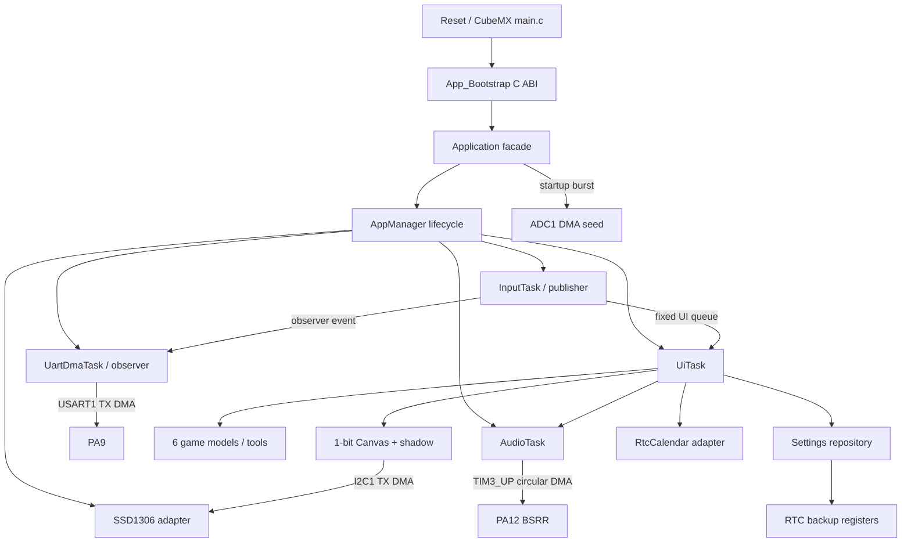

# 固件架构

## 目标与约束

STM32F103C8T6 只有 64 KiB Flash、20 KiB SRAM，没有 MMU，也不适合依赖动态内存。架构采用四个原则：静态容量、显式所有权、可测试核心、薄 HAL 适配层。CubeMX 管理寄存器、时钟和 IRQ 入口，产品行为位于 `App`，避免被代码生成器覆盖。

## 分层与所有权

`Core` 是由 CubeMX 表达的平台层：GPIO、DMA、ADC、I2C、RTC、TIM3、TIM4、USART、时钟树和中断入口。`App/Src/app_bridge.cpp` 是唯一 C→C++ 启动桥。`Application` 静态拥有所有服务和数据，并通过 `AppManager` 注册生命周期；没有服务通过堆创建或删除。

`AppModule` 定义 initialize/deinitialize 状态机，`AppManager` 按注册顺序初始化并在失败时逆序回滚。`AppTask` 使用调用方提供的静态 TCB 和栈；任务停止后驻留等待并能复用，而不是自删后立刻复用 TCB。

硬件无关核心包括 `ButtonEngine`、`Tween`、`Canvas`、五个独立游戏模型（Piano 只需 UI/Audio 状态）、`SettingsCodec` 和 `CalendarCodec`。这些组件由本机测试直接编译，不依赖 HAL 或 FreeRTOS。

启动严格分为两个阶段：第一阶段尚未创建任何 FreeRTOS 对象，依次完成 ADC DMA 熵采样、SSD1306 初始化、RTC/设置恢复、亮度设置和首帧 blocking 传输；第二阶段才由 AppManager 创建静态信号量、队列和任务，然后立刻启动调度器。Cortex-M3 FreeRTOS port 会在调度器前保持内核临界区中断屏蔽，因此任何依赖 TIM4 tick 或 DMA IRQ 的 HAL 操作都不得放在第二阶段。

## 设计模式

| 模式 | 使用位置 | 解决的问题 |
|---|---|---|
| Facade | `Application` | 隐藏模块装配和启动顺序 |
| Template Method | `AppModule`、`AppTask` | 统一初始化、回滚、任务入口和停止协议 |
| State | UI View、游戏 GamePhase、每键状态 | 取代旧固件的阻塞式嵌套循环 |
| Observer / Publish–Subscribe | `ButtonEventObserver` | 让 UART 诊断订阅按键，而不让输入服务依赖串口 |
| Producer–Consumer | 输入/UI、输入/UART、UI/Audio 固定队列 | 隔离不同执行速率，提供明确过载策略 |
| Adapter | SSD1306、RtcCalendar、EntropySource、buzzer timer | 把 HAL 接口转换为产品语义 |
| Repository | `SettingsStore` | 隔离 RTC backup register 编码和提交 |
| Strategy/Policy | MotionLevel、声音设置 | 用集中策略控制动画时长与反馈 |
| Table-driven UI | `MenuDefinition` | 菜单内容与导航代码分离 |

串口使用 Observer 只是事件分发边界；真正可能阻塞的格式化和 DMA 传输仍在低优先级消费者任务中。订阅回调只执行固定容量队列操作，因此 InputTask 的最坏执行时间保持有界。

没有为简单值对象增加虚拟工厂或动态依赖注入。设计模式服务于时序、所有权或测试边界，而不是为了模式本身。

## 任务与中断

| 执行单元 | 优先级 | 静态栈 | 周期/触发 | 职责 |
|---|---:|---:|---|---|
| InputTask | 4 | 256 words | 5 ms | GPIOB 快照、消抖、发布语义事件 |
| AudioTask | 3 | 192 words | 5 ms/通知 | 合并音调请求，配置 TIM3 DMA 波形 |
| UiTask | 2 | 384 words | 33 ms | 状态更新、渲染、OLED 差分 DMA 刷新 |
| UartDmaTask | 1 | 224 words | 队列事件 | 格式化遥测并启动 USART1 TX DMA |
| Idle | 0 | 128 words | 空闲 | `WFI` 低功耗等待 |

FreeRTOS 使用 1 kHz SysTick，HAL 使用 TIM4 作为 1 ms 时基。DMA1 Channel 1/4/6、I2C1 和 USART1 的 NVIC 优先级为 6，能够调用 `xSemaphoreGiveFromISR`。TIM3_UP Channel 3 不启用完成中断。

ISR 只确认 HAL 状态、写入无锁原子并释放信号量，不格式化、不绘图、不执行游戏逻辑。ISR 与任务共享的活动服务指针也是无锁原子，避免依赖编译器或偶然初始化时序。

## 游戏执行模型

每个游戏由 `ready → playing → game_over` 显式状态驱动。UI 每 33 ms 调用 `update(now_ms)`；模型内部按绝对 deadline 推进，并限制单帧 catch-up 次数。如果 OLED 或其他服务曾短暂延迟，游戏可以追帧但不会陷入无限补算。

- Dino、Air Raid、Pong 使用固定步长模型；
- Snake 根据得分缩短步长；
- Tetris 根据累计消行数改变重力周期；
- Air Raid 与 Pong 从 InputService 的稳定按键 bitmask 读取连续移动；
- Piano 把八个语义键映射到音调队列，不创建额外游戏任务。

所有数组容量固定：蛇身、障碍、敌机、子弹、Tetris 15 行位图和 UI 历史都不存在越界增长或运行时分配。

## 内存和失败策略

- `configSUPPORT_DYNAMIC_ALLOCATION=0`，不编译 `heap_n.c`；
- 链接器 `_Min_Heap_Size=0`，post-build 用符号表拒绝 `malloc/free/new/delete` 等堆依赖；
- ETL 容器固定容量，C++ 禁用异常、RTTI 和线程安全静态初始化；
- OLED Canvas 1024 B，shadow 1024 B；DMA 页缓冲只有 129 B；
- 输入队列溢出时丢最旧、留最新并计数；UART 和音调队列采用相同的“新状态优先”原则；
- I2C/UART DMA 都有有界等待、abort 和错误计数；失败页仍保持 dirty；
- ADC DMA 超时后使用 UID/tick 混合种子继续启动；
- System 页每秒采样四个业务任务的历史最小栈余量；
- 设置 DR1–DR3、日期 DR4–DR6 均使用 magic/checkword，并最后提交 magic，拒绝半写记录；
- 栈溢出和 `configASSERT` 进入故障路径，LED 可用于定位。

## CubeMX 再生成规则

1. 打开根目录 `.ioc`，保持 FreeRTOS middleware 关闭；
2. 保持 HAL timebase=TIM4、I2C1 remap=PB8/PB9、TIM3 internal clock；
3. 保持 DMA1 Channel 1/3/4/6 映射和 NVIC 6 配置；
4. 生成 CMake 工程后检查 `main.c` 的 USER CODE 仍调用 `App_Bootstrap()`；
5. 检查 `cmake/stm32cubemx/CMakeLists.txt` 仍包含 `dma.c`、ADC/I2C/TIM/UART 源文件；
6. 保留根 CMake 的 FreeRTOS Cortex 异常向量重命名规则；
7. 运行 `pwsh -File scripts/verify.ps1`，并检查 Debug/Release 内存报告。
